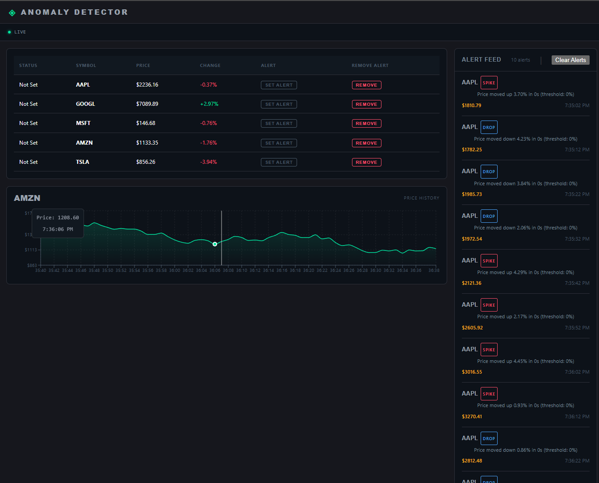
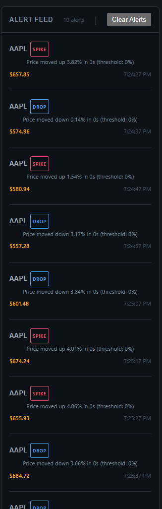
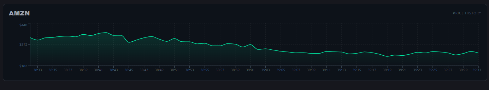
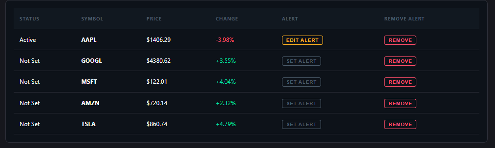

# 📈 Real-Time Stock Anomaly Detector

A full-stack application that simulates real-time stock data, detects anomalies (spikes, drops, and moving average deviations), and visualizes them through a live dashboard.

---

## 🚀 Overview

This project demonstrates a **real-time event-driven system** using WebSockets:

- Live stock price simulation
- Configurable anomaly detection
- Real-time alerts
- Interactive dashboard with charts

---

## ✨ Features

### 📡 Real-Time Stock Feed
- WebSocket-based updates
- Simulated realistic price movement
- Multiple stocks supported (AAPL, TSLA, MSFT, etc.)

---

### ⚠️ Anomaly Detection

#### 🔹 Spike / Drop Detection
- Detects sudden % change within a time window
- Configurable:
  - `thresholdPercent`
  - `windowSec`

#### 🔹 Moving Average Detection
- Detects deviation from average price
- Configurable:
  - `sampleSize`
  - `deviationPercent`

---

### 🔔 Alert System
- Real-time alerts via WebSocket
- Alert history stored in backend
- Includes:
  - Symbol
  - Price
  - Type (SPIKE / DROP / ABOVE_AVG / BELOW_AVG)
  - Reason
  - Timestamp

---

### 📊 Interactive Dashboard
- Live stock table
- Click any stock → view chart
- Real-time updates
- Alert feed panel
- Color-coded movement:
  - 🟢 Up (green)
  - 🔴 Down (red)

---

### 📉 Chart Visualization
- Built with **Recharts**
- Features:
  - Time-based X-axis
  - Price-based Y-axis
  - Tooltip (price + time)
  - Up/Down colored areas
  - Alert highlights

---

### 🔐 WebSocket Security
- Token-based authentication
- Secured connection via query params

---

## 🛠 Tech Stack

### Backend
- Node.js
- Express
- WebSocket (`ws`)

### Frontend
- React + TypeScript
- Recharts

---

## 📁 Project Structure
# 📈 Real-Time Stock Anomaly Detector

A full-stack application that simulates real-time stock data, detects anomalies (spikes, drops, and moving average deviations), and visualizes them through a live dashboard.

---

## 🚀 Overview

This project demonstrates a **real-time event-driven system** using WebSockets:

- Live stock price simulation
- Configurable anomaly detection
- Real-time alerts
- Interactive dashboard with charts

---

## ✨ Features

### 📡 Real-Time Stock Feed
- WebSocket-based updates
- Simulated realistic price movement
- Multiple stocks supported (AAPL, TSLA, MSFT, etc.)

---

### ⚠️ Anomaly Detection

#### 🔹 Spike / Drop Detection
- Detects sudden % change within a time window
- Configurable:
  - `thresholdPercent`
  - `windowSec`

#### 🔹 Moving Average Detection
- Detects deviation from average price
- Configurable:
  - `sampleSize`
  - `deviationPercent`

---

### 🔔 Alert System
- Real-time alerts via WebSocket
- Alert history stored in backend
- Includes:
  - Symbol
  - Price
  - Type (SPIKE / DROP / ABOVE_AVG / BELOW_AVG)
  - Reason
  - Timestamp

---

### 📊 Interactive Dashboard
- Live stock table
- Click any stock → view chart
- Real-time updates
- Alert feed panel
- Color-coded movement:
  - 🟢 Up (green)
  - 🔴 Down (red)

---

### 📉 Chart Visualization
- Built with **Recharts**
- Features:
  - Time-based X-axis
  - Price-based Y-axis
  - Tooltip (price + time)
  - Up/Down colored areas
  - Alert highlights

---

### 🔐 WebSocket Security
- Token-based authentication
- Secured connection via query params

---

## 🛠 Tech Stack

### Backend
- Node.js
- Express
- WebSocket (`ws`)

### Frontend
- React + TypeScript
- Recharts

---

## 📁 Project Structure
server/
├── index.js
├── config.js

client/
├── components/
│ ├── ListStocks.tsx
│ ├── FocusChart.tsx
│ ├── AlertFeed.tsx
│ └── StatusBar.tsx
├── pages/
│ └── Dashboard.tsx


---

##  Setup Instructions

### 1️⃣ Backend

```bash
cd server
npm install
node start

## Server runs @
http://localhost:4000

### 2️⃣ Frontend

cd client
npm install
npm run dev

## Client runs @
http://localhost:3000

## API Endpoints
## Get Stocks
GET /stocks
## Set Alert
PUT /stocks/:symbol/alert
## Remove Alert
DELETE /stocks/:symbol/alert
## Get Alert History
GET /alerts


## 🔄 WebSocket
## Connect
ws://localhost:4000/stocks?token=dinesh-key-123


## How It Works
Backend generates stock prices continuously
Price history is stored per stock
User configures alerts from frontend
Backend evaluates anomaly conditions
If triggered:
Alert stored in queue
Sent via WebSocket
Frontend updates:
Stock table
Chart
Alert feed


## 📸 Screenshots

### Dashboard


### Alert Feed


### Chart View


### Stock List



## 🔮 Future Enhancements
📊 Candlestick charts (OHLC)
🗄 Database persistence (MongoDB/Postgres)
🔔 Toast notifications
📉 Advanced indicators (EMA, RSI)
👤 Multi-user support
📈 Multi-stock comparison

👨‍💻 Author

Dinesh Babu"# Stock-Anomaly-Detector" 
